# Customer Support CRM

A full-stack multilingual support platform combining ticket operations, team management, realtime communication, omnichannel support, SLA automation, reporting, and AI-assisted customer service.

```text
Internal CRM
+
Customer Portal
+
Realtime
+
AI / Live Support
+
Email / WhatsApp / SMS
```

One React build serves two products — a staff workspace and a customer portal — over one Express API, one PostgreSQL schema, one realtime stream, and backend adapters for every external channel.

---

## 1. Main Support Journey

Every channel converges on the same ticket → routing → agent → resolution → feedback path.

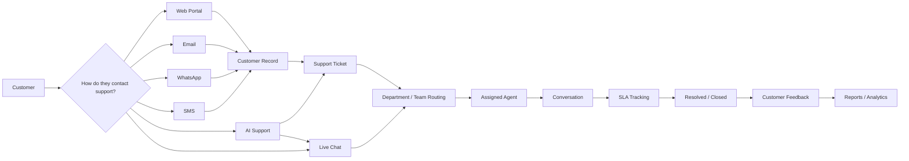

- Multiple support channels converge into the CRM.
- Async channels (Email / WhatsApp / SMS) resolve or create a `Customer`, then open a normal ticket.
- Live Chat is itself a `LIVE_CHAT` ticket — same infrastructure, routed by department.
- AI Support can escalate into an async ticket or hand off to Live Chat.
- Every ticket is owned by a team and may be assigned to an agent.
- SLA timers, notifications, realtime, and reporting sit around the ticket lifecycle.

---

## 2. System Architecture

The browser only ever speaks REST and reads an SSE stream. Everything else — PostgreSQL, email, WhatsApp, SMS, blob storage, the AI provider — is reached only from the Express backend.

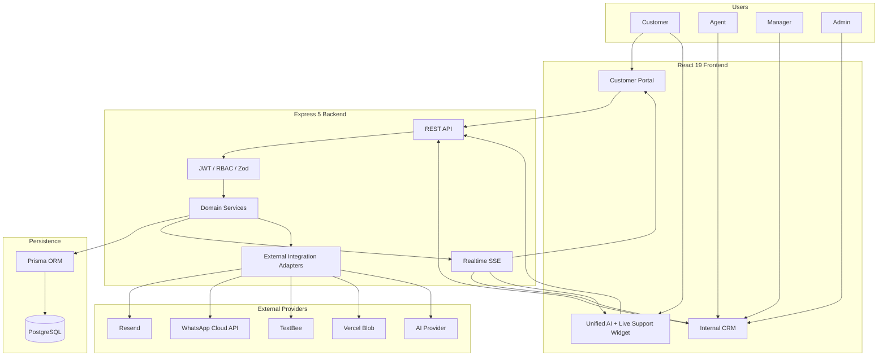

```text
Browser → Express → Domain Services → Prisma → PostgreSQL
                         ↓
                  realtime / integrations
```

- One React app renders the Internal CRM, the Customer Portal, and the floating Support Widget behind role-aware protected routing.
- Express resolves the actor from a JWT, enforces RBAC + team scope, and runs Zod validation before any handler.
- Domain services own the rules; Prisma is the only thing that touches PostgreSQL.
- Realtime events publish **after** the transaction commits; integration adapters hold all external credentials.

---

## 3. Internal CRM Map

What Admin / Manager / Agent actually work with.

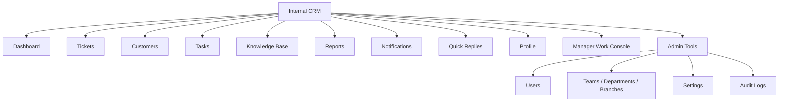

| Role | Sees | Scope |
| --- | --- | --- |
| `ADMIN` | Everything above | Global |
| `MANAGER` | Overview, Tickets, Team, Knowledge Base, Tasks, Reports | Own team + team-owned tickets |
| `AGENT` | Dashboard, Tickets, Customers, Knowledge Base, Tasks | Day-to-day support work |

Reports splits into Overview, SLA Performance, Agent Performance, Ticket Breakdown. Quick Replies, Users, Audit Logs, and Settings are Admin-only (Quick Replies also Manager where permitted).

---

## 4. Customer Portal Map

The customer-facing product.

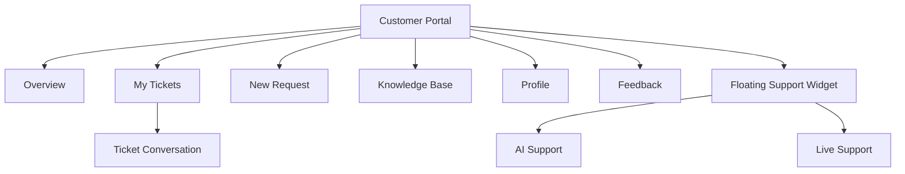

- Routes live under `/portal/*` and are only reachable by a `CUSTOMER` user.
- Ticket Conversation is realtime — the customer sees agent replies without refreshing.
- Feedback is a post-resolution rating + comment on a resolved ticket.
- The Support Widget is one persistent floating surface on every portal page.

---

## 5. Unified AI + Live Support Widget

One persistent floating surface, not two pages. It is stateful, so it is a state machine. Changing the visible channel is **never** itself a transition of the live session.

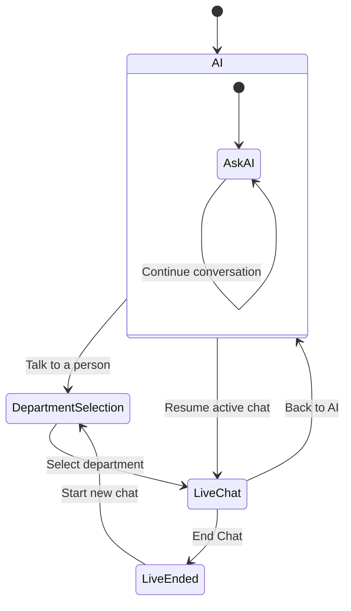

```text
AI <-> Live switching = presentation only
X = minimize only
End Chat = terminate session (Live-only, confirmed)
AI history persists across switch + portal navigation
Active Live Chat persists until RESOLVED / CLOSED
```

- **AI** — default. Knowledge-base-grounded assistant. Can retry a failed message or escalate to an async ticket.
- **DepartmentSelection** — compact in-widget department picker, shown only when there is no resumable live chat.
- **LiveChat** — a realtime `LIVE_CHAT` ticket with a human agent; auto-surfaces when a live chat is or becomes active.
- **LiveEnded** — terminal; reached only via explicit **End Chat**. "Start new chat" returns to DepartmentSelection.
- Compat routes `/portal/support` and `/portal/live-chat` redirect into this widget with `?support=ai` / `?support=live`.

---

## 6. Ticket Lifecycle

The exact transition matrix from the backend workflow service ([`ticket.service.ts`](./server/src/modules/tickets/ticket.service.ts)).

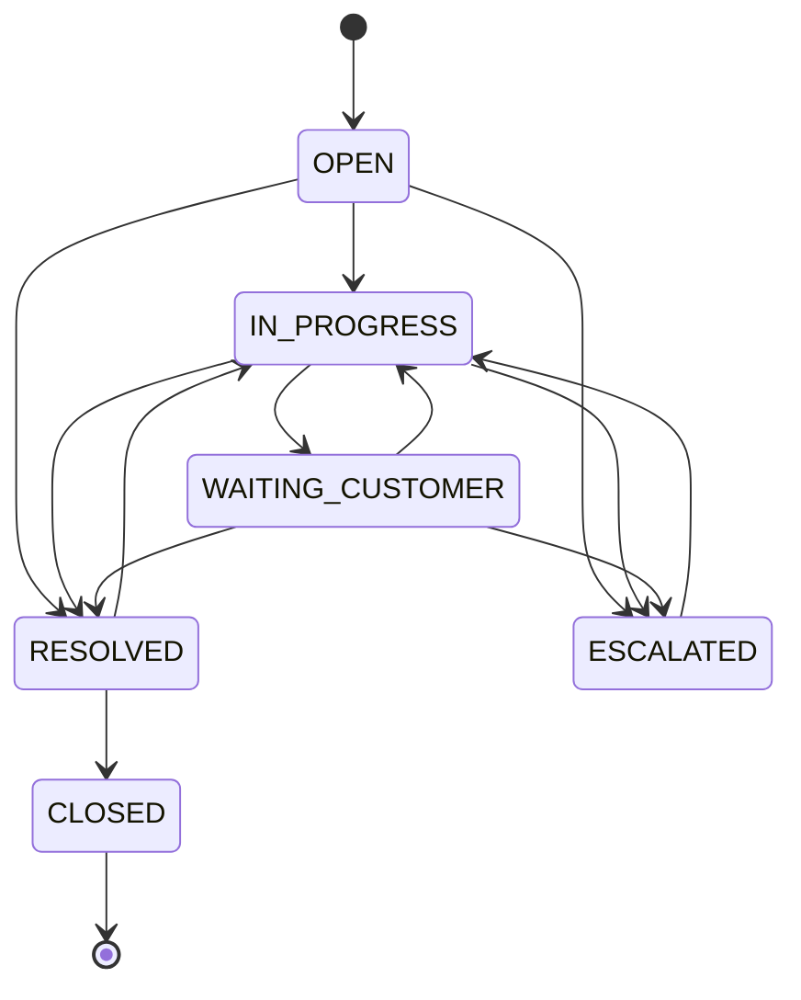

- A ticket is created in `OPEN`. `CLOSED` is terminal and has no outgoing transitions.
- `OPEN` cannot jump straight to `WAITING_CUSTOMER` or `CLOSED`.
- `RESOLVED` can reopen to `IN_PROGRESS`; `CLOSED` cannot.
- `ESCALATED` can only return to `IN_PROGRESS`.
- Agents cannot move a ticket into or out of `ESCALATED` — Manager/Admin only.
- `RESOLVED` stamps `resolvedAt`, `CLOSED` stamps `closedAt`; an invalid move returns `409 INVALID_STATUS_TRANSITION`.

---

## 7. Team Ownership & Manager Scope

Manager authorization is scoped to explicit team ownership, not to whoever is currently assigned.

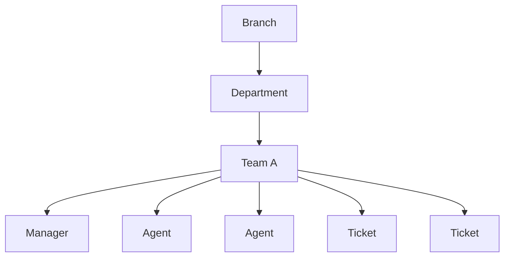

```text
Manager scope
      ↓
managed Team
      ↓
Team Agents + Team Tickets
```

`Ticket.teamId` stores the owning team on the ticket itself. Assignment changes over a ticket's life; ownership does not. A manager's visibility, actions, and realtime events are all scoped to tickets where `teamId` matches their team, so the boundary stays stable through assignment churn.

---

## 8. Frontend Architecture

```text
client/src/
├── app/          router (protected + role routes), layouts, providers
├── components/   ui primitives, shared composites
├── features/     one folder per domain
├── services/     axios API client
├── locales/      en / ar
└── lib/          shared helpers
```

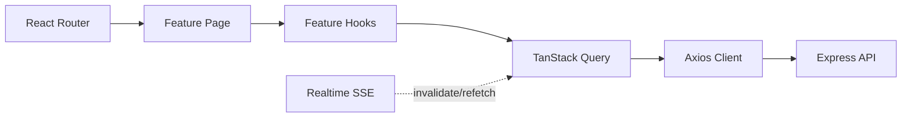

```text
Router → Feature page → Feature hooks → TanStack Query → Axios → Backend
```

- Pages compose UI only; feature hooks own every query and mutation for that domain.
- TanStack Query manages the server-state cache (dedupe, caching, background refetch, mutation lifecycle).
- Realtime events invalidate query keys, so open screens refresh without a manual reload.

| Technology | Version | Used for |
| --- | --- | --- |
| React | 19 | UI framework |
| TypeScript | 5.9 | Static typing |
| Vite | 7 | Dev server + production bundle |
| React Router | 7 | Route tree, protected + role-scoped routes |
| TanStack Query | 5 | Server-state cache, invalidation, mutations |
| TanStack Table | 8 | Data-heavy CRM tables |
| React Hook Form + Zod | 7 / 4 | Typed forms matching server schemas |
| Tailwind CSS | 4 | Styling, full RTL |
| Axios | 1 | HTTP client with auth header injection |
| i18next / react-i18next | 25 / 15 | EN/AR localization + RTL |
| Lexical | 0.49 | Rich text editor for replies + KB articles |
| Recharts | 3 | Charts in reports |
| Lucide React | 1 | Icon set |
| DOMPurify | 3 | Sanitize rich HTML before render |
| react-international-phone | 4 | International phone input |
| Radix UI (Select) | 2 | Accessible select primitive |
| Vitest + Testing Library | 3 / 16 | Unit + component tests |
| Inter + Cairo (`@fontsource`) | 5 | Latin + Arabic typefaces |

---

## 9. Backend Architecture

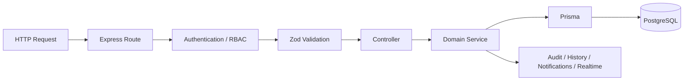

1. **Route** — Email / WhatsApp / SMS webhooks mount before the JSON parser to keep the raw body for signature checks; everything else parses JSON.
2. **Auth / RBAC** — resolve the actor from `Authorization: Bearer <jwt>`, check role + team scope (plus an active-user check on sensitive admin routes).
3. **Zod validation** — body, params, query against the module schema.
4. **Controller** — thin; unwraps the request and calls the service.
5. **Domain service** — ticket workflow, team ownership, SLA logic, routing; Prisma with transactions where multiple rows change together.
6. **Side effects** — audit log, ticket history, in-app notification, and a realtime event published only after commit.

| Technology | Version | Used for |
| --- | --- | --- |
| Node.js | 20+ | Runtime |
| Express | 5 | HTTP API |
| TypeScript | 5.9 | Static typing |
| Prisma | 6 | ORM, schema, migrations |
| PostgreSQL | — | Primary relational database |
| jsonwebtoken | 9 | JWT issue + verification |
| bcrypt | 6 | Password hashing |
| Zod | 4 | Request validation |
| Resend | 6 | Email delivery + inbound email |
| @vercel/blob | 2 | Attachment storage |
| sanitize-html | 2 | Server-side HTML sanitization |
| busboy | 1 | Multipart upload parsing |
| libphonenumber-js | 1 | Phone normalization for SMS / WhatsApp |
| Vitest + Supertest | 3 / 7 | Unit + HTTP-level API tests |

**Domain modules** (`server/src/modules/`): `auth`, `users`, `customers`, `tickets`, `teams`, `departments`, `branches`, `categories` · `tasks`, `notifications`, `reports`, `dashboard`, `manager`, `collaboration`, `audit-logs`, `sla-automation`, `quick-replies`, `settings` · `portal`, `knowledge-base`, `live-chat`, `customer-ai`, `feedback`, `ai` · `integrations/email`, `integrations/whatsapp`, `integrations/sms`, `attachments`, `realtime`.

---

## 10. Realtime Message Flow

SSE over `fetch` + a stream reader (not native `EventSource`) so the JWT rides in the `Authorization` header.

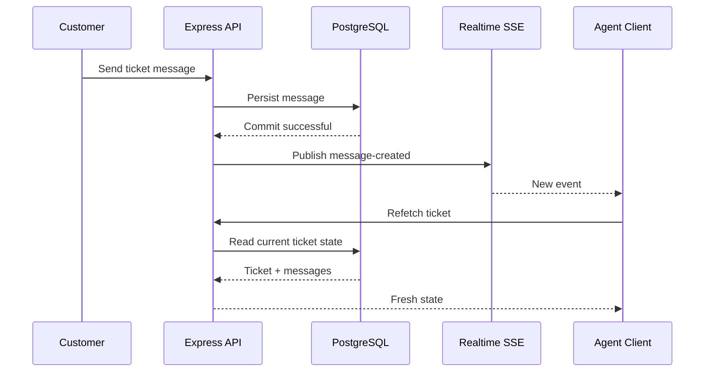

```text
SSE = tells the UI something changed
REST = retrieves the authoritative state
```

- Events publish only after the producing transaction commits.
- Payloads carry identifiers, not full records.
- Events are routed server-side to the owning customer, the assigned agent, and the owning team.
- A dropped or reconnected stream never leaves the UI showing stale data as authoritative.

---

## 11. Omnichannel Flow

Email / WhatsApp / SMS are not isolated inboxes — inbound provider messages become CRM tickets, and agents reply from inside the CRM.

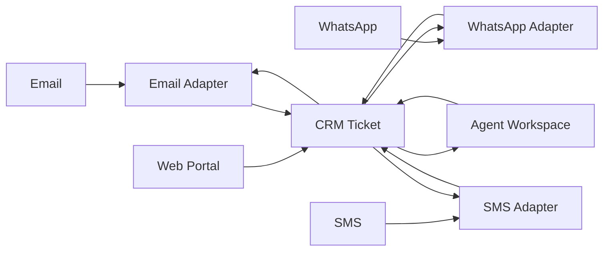

- Provider inbound → adapter verifies the webhook signature, resolves/creates a `Customer` by email or phone, opens a ticket tagged with the `Channel` (`WEB`, `EMAIL`, `WHATSAPP`, `SMS`, `LIVE_CHAT`).
- The agent answers inside the CRM — one workspace, not five provider dashboards.
- Backend sends outbound replies back through the same provider adapter.
- Every integration is optional in dev: unset env vars → a structured "not configured" response, the rest of the CRM unaffected.

---

## 12. Domain Model

Only the relationships that matter for the workflow ([`schema.prisma`](./server/prisma/schema.prisma)).

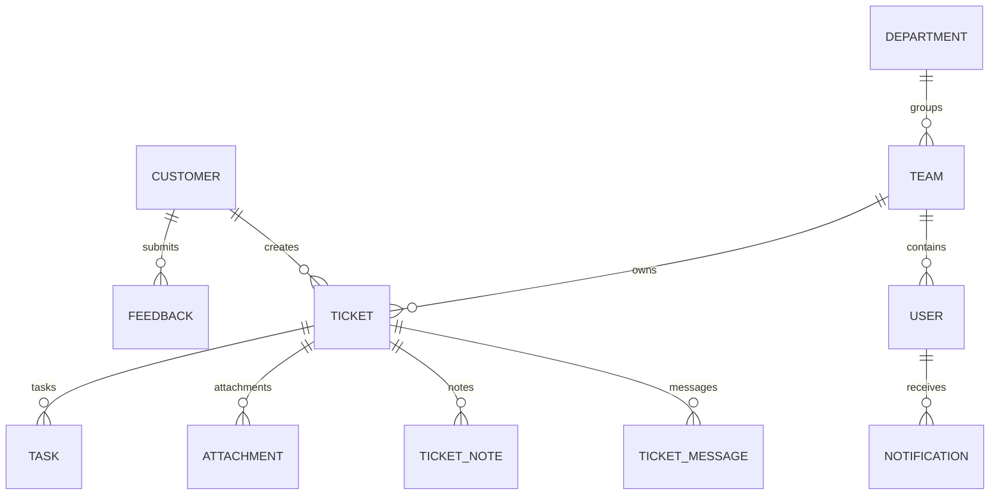

| Model | What it is |
| --- | --- |
| `User` | Auth identity — internal staff or the login behind a portal customer (`Role`: ADMIN / MANAGER / AGENT / CUSTOMER) |
| `Customer` | CRM customer profile — contact details, notes, ticket history |
| `Ticket` | Central unit of support work — status, priority, channel, assignee, `teamId` |
| `TicketMessage` / `TicketNote` | Customer-visible conversation / internal-only notes |
| `TicketWatcher` / `TicketMention` | Follow a ticket / be @mentioned |
| `TicketHistory` / `AuditLog` | Per-ticket change timeline / administrative activity trail |
| `Team` / `Department` / `Branch` | Ownership + organizational structure |
| `Task` | Operational follow-up attached to support work |
| `Notification` | In-app event surface for a user |
| `KnowledgeArticle` | KB content (`DRAFT` / `PUBLISHED`); published articles ground the AI |
| `SlaRule` | Response/resolution target the SLA monitor evaluates |
| `Feedback` / `QuickReply` | Post-resolution rating + comment / reusable canned response |

---

## 13. Feature Overview

| Area | Capabilities |
| --- | --- |
| Tickets | Workflow state machine, routing, assignment, messages, notes, attachments, history, watchers, @mentions, SLA |
| Customers | Profiles, notes, ticket history, role-scoped mutation limits |
| Teams | Manager scope, agents, explicit `Ticket.teamId` ownership, departments, branches |
| Portal | Tickets, KB, profile, post-resolution feedback |
| Support | Unified AI + Live Chat floating widget |
| Channels | Web, Email, WhatsApp, SMS, Live Chat |
| Operations | Tasks + reminders, notifications, reports, audit logs, settings, quick replies |
| Automation | SLA monitor, task reminders, live-chat inactivity close (`POST /api/internal/*`, `CRON_SECRET`) |

---

## 14. Local Development

**Prerequisites:** Node.js 20+, npm, a PostgreSQL database.

```bash
git clone https://github.com/bahaayoussof/crm.git
cd crm
cp client/.env.example client/.env
cp server/.env.example server/.env
```

```bash
# frontend — http://localhost:5173, expects API at VITE_API_URL
cd client && npm install && npm run dev

# backend — http://localhost:3000, health at GET /api/health
cd server && npm install && npm run prisma:generate && npm run dev

# both together, from repo root
npm install && npm run dev
```

`client/.env.example` and `server/.env.example` are the source of truth for configuration. Integration groups (Email, WhatsApp, SMS, Blob, AI) can be left blank in development — each unset feature returns a structured "not configured" response.

---

## 15. Quality & Testing

Type-checking, linting, tests, and a clean production build are the quality gate. Vitest across both packages — Testing Library for components, Supertest for HTTP-level API tests. Zod on both sides keeps form and request validation aligned.

```bash
# per package (client / server), or from repo root to fan out to both
npm run typecheck
npm run lint
npm test
npm run build
```

---

## 16. Documentation

Deeper architecture, workflows, decision records, the API contract, and per-integration notes live in [`docs/`](./docs).

---

## 17. Public Demo Environment

The same application, booted with `DEMO_MODE=true` (server) and `VITE_DEMO_MODE=true`
(client) — not a fork or a mocked UI. Full detail: [`docs/26-demo-environment.md`](./docs/26-demo-environment.md).

- **Accounts** (password `Demo123!`, real bcrypt, no auth bypass): `admin@demo.local`,
  `manager@demo.local`, `agent@demo.local`, `customer@demo.local`. The login page shows
  one-click role buttons; a lightweight "Demo Environment" banner renders globally.
- **Provider safety:** WhatsApp / SMS / Email outbound transports are simulated at the
  adapter boundary — the ticket message, history, notifications and realtime events are
  still written, but no external call is made and no provider credentials are needed. AI
  runs under a tight per-user rate limit.
- **Protected:** the four demo accounts can't have email/password/role changed, be
  deactivated or deleted; departments/teams can't be deleted — all enforced on the
  backend (`403 DEMO_PROTECTED_RESOURCE`). Everything else stays interactive.
- **Seed & reset:** `npm run demo:seed` (baseline + accounts + 6 realistic
  demo-customer scenarios). `DEMO_MODE=true DATABASE_ENV=demo npm run demo:reset`
  truncates and re-seeds — it refuses to run without both flags and never touches
  migrations.
- **Vercel:** `server/vercel.json` no longer declares the `*/5 * * * *` cron jobs
  (incompatible with Vercel Hobby); the SLA / task-reminder endpoints and logic are
  intact and still `CRON_SECRET`-protected.
