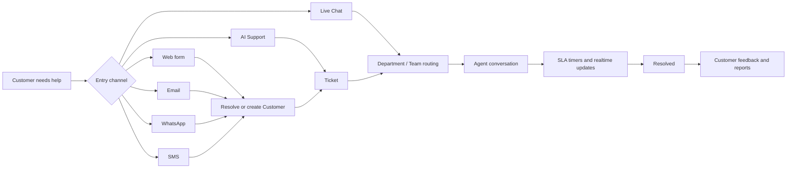
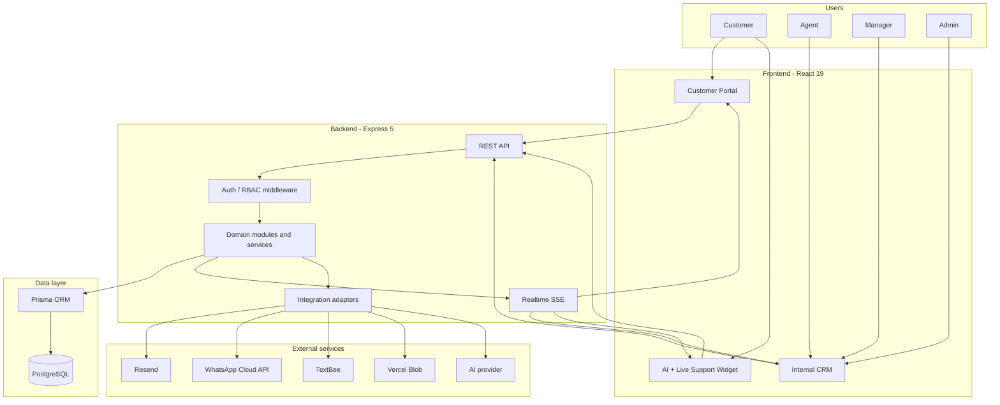
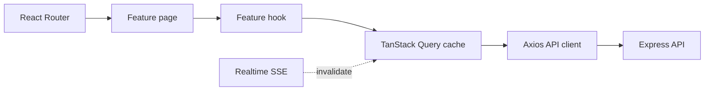
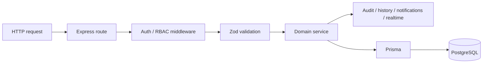
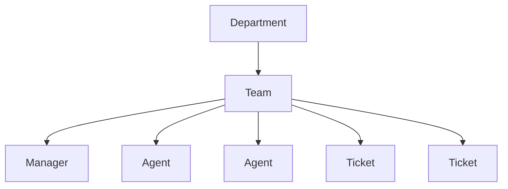
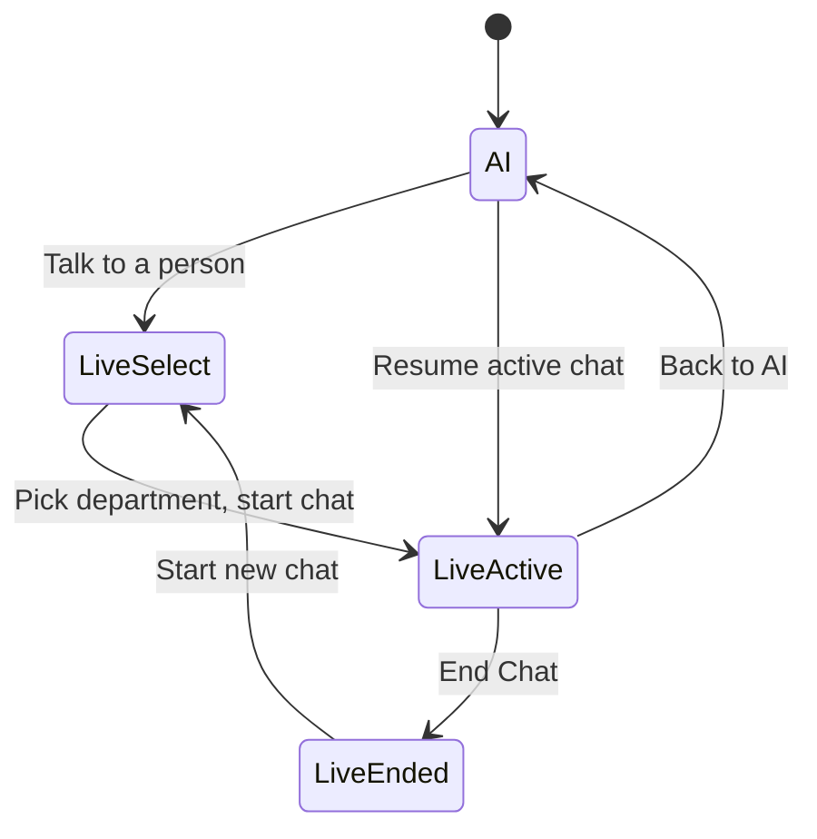
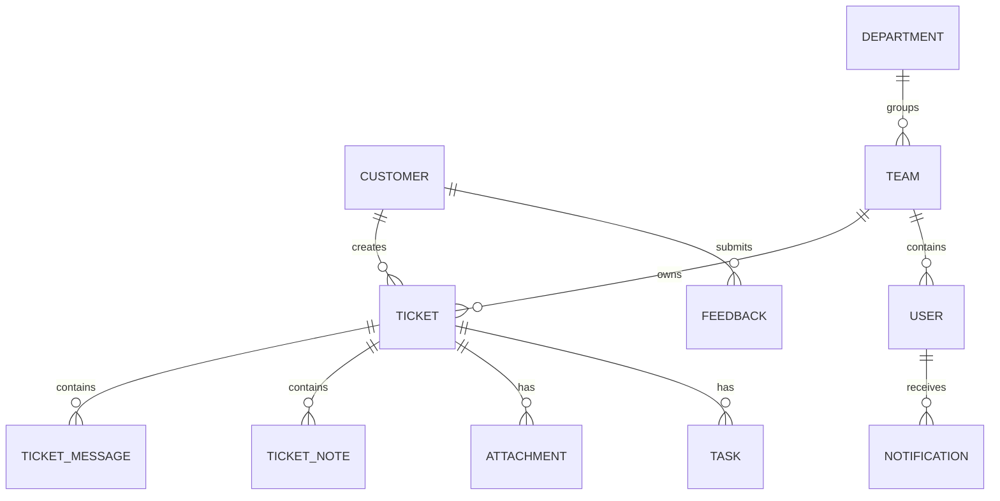
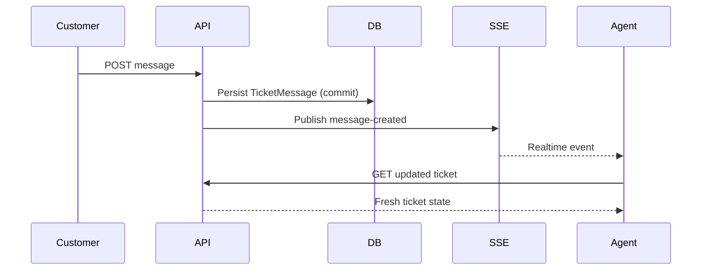

# Customer Support CRM

A full-stack, multilingual support platform combining ticket management, team operations, realtime support, omnichannel communication, reporting, SLA automation, and AI-assisted customer support.

This is not ticket CRUD. It is two products in one codebase — an **internal support workspace** for staff and a **customer portal** for the people they support — wired together by a shared ticket/team workflow, a realtime event layer, and backend adapters for external communication channels.

A support request can start as a web form, an email, a WhatsApp message, an SMS, an AI chat, or a live chat. Wherever it starts, the CRM pulls it into one place: a **ticket** owned by a **team**, worked by an **agent**, watched by a **manager**, measured against an **SLA**, and closed with **customer feedback**.

```text
Internal CRM  +  Customer Portal  +  Realtime Support  +  Omnichannel Integrations  +  AI Support
```

---

## What problem does it solve?

A real support interaction has many moving parts:

```text
A customer sends a request.
Someone has to route it to the right team.
An agent needs the full context and conversation history.
A manager needs visibility over their team's workload and SLAs.
SLA timers have to be tracked and escalated.
The customer expects realtime updates, not email tag.
The conversation might continue over Web, Email, WhatsApp, SMS, or Live Chat.
Eventually management needs reports and an audit trail.
```

Most teams solve this with five disconnected tools. This CRM connects those steps into one system: a single ticket model, a single team-ownership rule, one realtime channel, and one place for agents to work — instead of five provider dashboards.

---

## Who uses it

| Role | Uses | Responsibility |
| --- | --- | --- |
| `ADMIN` | Internal CRM | Global administration and full visibility |
| `MANAGER` | Internal CRM | Manage own team, its agents, and team-owned tickets |
| `AGENT` | Internal CRM | Handle day-to-day support work |
| `CUSTOMER` | Customer Portal | Open tickets and use the support channels |

**Internal CRM** — the staff workspace. Used by Admin, Manager, and Agent. Ticket queues, customer records, team management, reports, tasks, SLA automation, audit logs, knowledge base authoring.

**Customer Portal** — the customer-facing app. Used by Customer only. Their own tickets, realtime conversation, knowledge base, profile, post-resolution feedback, and one floating support widget backed by AI and live chat.

The client is a single React build that renders both experiences behind role-aware protected routing. A user only ever sees the one that matches their role.

---

## The support journey

This is the fastest way to understand the project. It answers one question: **what happens between a customer asking for help and that request being resolved?** No matter which channel the request enters through, the CRM tries to converge it onto the same ticket → routing → agent → resolution → feedback path. Focus on where the arrows merge.



### How this flow works

1. **Entry channel.** A request enters as a portal web form, an inbound Email, a WhatsApp message, an SMS, an AI Support chat, or a Live Chat.
2. **Customer identification.** For async channels the backend adapter resolves an existing `Customer` by email or phone, or creates one. Portal and live-chat users are already authenticated.
3. **Ticket creation.** The request becomes a `Ticket` with a channel tag (`WEB`, `EMAIL`, `WHATSAPP`, `SMS`, `LIVE_CHAT`), a status, and a priority. AI Support can escalate into a ticket; Live Chat is itself a `LIVE_CHAT` ticket.
4. **Routing.** The ticket is placed with a department and a team. Team ownership is stored explicitly on the ticket.
5. **Agent conversation.** An assigned agent works the ticket — customer-visible messages, internal notes, attachments, quick replies, and optional AI assist.
6. **SLA and realtime.** SLA rules track response/resolution windows and can escalate. Every change publishes a realtime event so the customer and staff see updates live.
7. **Resolution.** The ticket moves through `RESOLVED` / `CLOSED` (with `WAITING_CUSTOMER` and `ESCALATED` as intermediate states).
8. **Feedback and reporting.** The customer can submit feedback after resolution; the data feeds dashboards and the reports area.

---

## System architecture

This diagram answers: **how do the frontend, backend, database, realtime layer, and external providers fit together?** The key thing to notice is that browsers never talk to PostgreSQL, WhatsApp, SMS, email, or blob storage directly — every one of those calls goes through the Express backend. The frontend only ever speaks REST and consumes an SSE stream.



### How a request moves through the system

1. **Presentation layer.** One React application renders the Internal CRM, the Customer Portal, and the floating Support Widget. Routing is role-aware and protected.
2. **API boundary.** Express receives every request. Middleware resolves the authenticated actor from a JWT, checks role and access, and runs Zod validation before any handler executes.
3. **Business layer.** Domain modules (`tickets`, `customers`, `teams`, `manager`, `portal`, `reports`, `live-chat`, `customer-ai`, …) hold the rules. Controllers stay thin; services do the work.
4. **Persistence.** Services call Prisma; Prisma talks to PostgreSQL. Nothing else touches the database.
5. **Realtime.** After the database work commits, services publish events onto an SSE stream. Clients react by refetching. REST stays the source of truth (see [Realtime](#realtime)).
6. **Integrations.** Email, WhatsApp, SMS, blob storage, and the AI provider are reached only from backend integration adapters. The browser has no credentials for and no direct path to any of them.

---

## Frontend architecture

Before the dependency table, here is how the client is organized. It answers: **where does code for a given screen live, and how does that screen get its data?**

```text
client/src/
├── app/
│   ├── router/       route tree, protected + role routes
│   ├── layouts/      app shell, sidebar, auth layout, nav config
│   └── providers/    query client, auth, i18n, realtime
├── components/
│   ├── ui/           shared primitives (buttons, inputs, DataTable, …)
│   ├── shared/       cross-feature composite components
│   └── date-picker/
├── features/         one folder per domain
│   ├── tickets/  customers/  users/  manager/  reports/  tasks/
│   ├── dashboard/  notifications/  audit-logs/  quick-replies/  settings/
│   ├── knowledge-base/  organization/  profile/
│   ├── portal/      customer-facing pages
│   ├── customer-ai/ the support widget (AI + live chat shell)
│   ├── live-chat/   live chat API + hooks
│   ├── realtime/    SSE provider + status
│   └── ai-assistant/ internal agent-assist UI
├── services/         axios API client
├── locales/          en / ar translation resources
└── lib/              shared helpers
```



### How frontend data flows

1. **React Router** selects a feature page based on the URL and the user's role/audience.
2. The **feature page** composes the UI. It does not fetch directly.
3. **Feature hooks** own every query and mutation for that domain.
4. **TanStack Query** manages the server-state cache — dedupe, caching, background refetch, mutation lifecycle.
5. **Axios** carries requests to the Express API with the `Authorization` bearer token attached.
6. **Realtime events** arriving on the SSE stream invalidate the relevant query keys, so open screens refresh themselves without a manual reload.

---

## Frontend technology stack

Versions from [`client/package.json`](./client/package.json).

| Technology | Used for |
| --- | --- |
| React 19 | UI framework |
| TypeScript | Static typing across the client |
| Vite 7 | Dev server and production bundle |
| React Router 7 | Route tree, protected and role-scoped routes |
| TanStack Query 5 | Server-state cache, invalidation, mutations, realtime-driven refetch |
| TanStack Table 8 | Shared behavior for the data-heavy CRM tables |
| React Hook Form + Zod | Typed forms with client-side validation matching the server schema |
| Tailwind CSS 4 | Styling, with full RTL support |
| Axios | HTTP client with auth header injection |
| i18next / react-i18next | EN/AR localization and RTL |
| Lexical | Rich text editor for ticket replies and knowledge articles |
| Recharts | Charts in the reports area |
| Lucide React | Icon set |
| DOMPurify | Sanitizing rich HTML before render |
| react-international-phone | International phone number input |
| Radix UI (Select) | Accessible select primitive |
| Vitest + Testing Library | Unit and component tests |
| Inter + Cairo (`@fontsource`) | Latin and Arabic typefaces |

Feature-based folders, shared `DataTable` and UI primitives, and one build that serves both the internal CRM and the customer portal.

---

## Backend architecture

Every domain module follows the same shape, so once you have read one you can navigate them all. This diagram answers: **what happens between the frontend calling the API and a row changing in PostgreSQL?**



### What happens when the frontend calls the API?

1. **Express receives the request.** WhatsApp, Email, and SMS webhooks are mounted before the JSON body parser so their raw body stays intact for signature verification; everything else parses JSON.
2. **Authentication** resolves the actor from the `Authorization: Bearer <jwt>` header.
3. **Route middleware** checks the actor's role and access — including team scope for managers, and a fresh-token / active-user check on sensitive admin routes.
4. **Zod** validates the request body, params, and query against the module's schema.
5. **The domain service** applies business rules — this is where ticket workflow, team ownership, SLA logic, and routing live.
6. **Prisma** reads and writes PostgreSQL, using transactions where multiple rows must change together.
7. **Side effects** may fire: an audit-log entry, a ticket-history row, an in-app notification, and a realtime event published only after the transaction commits.
8. **A structured response** returns to the frontend — a typed payload on success, a `{ error: { code, message } }` shape on failure.

---

## Backend technology stack

Versions from [`server/package.json`](./server/package.json).

| Technology | Used for |
| --- | --- |
| Node.js 20+ | Runtime |
| Express 5 | HTTP API |
| TypeScript | Static typing across the server |
| Prisma 6 | ORM, schema, and migrations |
| PostgreSQL | Primary relational database |
| jsonwebtoken | JWT issue and verification |
| bcrypt | Password hashing |
| Zod | Request validation |
| Resend | Email delivery and inbound email |
| @vercel/blob | Attachment storage |
| sanitize-html | Server-side HTML sanitization of rich text |
| busboy | Multipart upload parsing |
| libphonenumber-js | Phone number normalization for SMS/WhatsApp |
| Vitest + Supertest | Unit and HTTP-level API tests |

### Domain modules

Grouped by purpose (`server/src/modules/`):

**Core** — `auth`, `users`, `customers`, `tickets`, `teams`, `departments`, `branches`, `categories`

**Support operations** — `tasks`, `notifications`, `reports`, `dashboard`, `manager`, `collaboration` (watchers / mentions), `audit-logs`, `sla-automation`, `quick-replies`, `settings`

**Customer experience** — `portal`, `knowledge-base`, `live-chat`, `customer-ai`, `feedback`, `ai` (internal agent-assist)

**Integrations & delivery** — `integrations/email`, `integrations/whatsapp`, `integrations/sms`, `attachments`, `realtime`

Shared concerns (`server/src/shared/`): `errors`, `rich-text`, `sla`, `team` scope resolution, `validation`, `utils`. Middleware (`server/src/middleware/`): `auth`, `validate`, `rate-limit`, `require-active-user`, `require-fresh-token`, error and not-found handlers.

---

## Roles and team ownership

Manager authorization is **not** based on whichever agent happens to be assigned to a ticket right now. A ticket has explicit team ownership, and that is the boundary managers are scoped to. This diagram shows the ownership chain.



### How ownership works

```text
Department
   └── Team
        ├── Manager   (one per team in V1)
        ├── Agents    (a user belongs to one team in V1)
        └── Tickets   (Ticket.teamId — explicit ownership)
```

- A **department** groups one or more **teams**.
- A **team** has one manager, its agents, and the tickets it owns.
- A **manager's** visibility and actions are scoped to their own team, its agents, and tickets where `Ticket.teamId` matches.

**Why `Ticket.teamId` is stored explicitly:** assignment changes over a ticket's life — it can be reassigned between agents, or left unassigned. If management scope were derived from the current assignee, ownership would drift every time the assignee changed. Storing the owning team on the ticket keeps the management boundary stable regardless of assignment churn. The same `teamId` also drives realtime event routing, so a manager's live updates stay scoped to their team.

Authorization and validation are enforced server-side on every request; the frontend role checks are for UX only.

---

## Unified AI + Live Support widget

Instead of separate AI and Live Chat pages, the customer portal has **one persistent floating surface**. This is a signature feature and it is stateful, so it is drawn as a state machine rather than a flow. Watch which transitions are triggered by the customer versus by the system, and note that changing the visible channel is never itself a transition of the live session.



### The states

- **AI** — the default. A knowledge-base-grounded assistant. All AI conversation state lives in the widget, so it survives portal navigation. From here the customer can retry a failed message, escalate to a support ticket, or press "Talk to a person".
- **LiveSelect** — a compact department picker shown inside the widget when there is no resumable live chat.
- **LiveActive** — a realtime conversation with a human agent (a `LIVE_CHAT` ticket). Shown whenever there is a non-terminal live chat, whether it was just started here or was already open when the widget loaded.
- **LiveEnded** — terminal state for a session. The only way in is the explicit **End Chat** action (behind a confirm). From here "Start new chat" returns to LiveSelect.

### Rules the widget enforces

- The visible channel (AI vs Live) is **presentation only**. Switching it never starts or ends anything.
- The AI conversation survives switching channels and navigating the portal.
- An active live chat survives switching to the AI view and back; a `RESOLVED` / `CLOSED` chat is not resumable.
- The `X` button **only minimizes** the widget.
- **End Chat** is the only thing that terminates a live session, and it is a Live-only header action separate from `X` so a minimize is never mistaken for ending the chat.

Compatibility routes `/portal/support` and `/portal/live-chat` redirect into this one widget in the correct channel (`?support=ai` / `?support=live`). There is no standalone Live Chat page.

---

## Domain model

The schema is managed with Prisma ([`server/prisma/schema.prisma`](./server/prisma/schema.prisma)). This diagram shows only the relationships that matter for understanding the workflow — not every table.



### The important objects

| Model | What it is |
| --- | --- |
| `User` | An authentication identity — internal staff, or the login behind a portal customer |
| `Customer` | The CRM customer profile (contact details, notes, ticket history) |
| `Ticket` | The central unit of support work — status, priority, channel, assignee, `teamId` |
| `TicketMessage` | The customer-visible conversation on a ticket |
| `TicketNote` | Internal-only collaboration, never shown to the customer |
| `TicketWatcher` / `TicketMention` | Follow a ticket / be @mentioned on it |
| `TicketHistory` / `AuditLog` | Per-ticket change timeline / administrative activity trail |
| `Team` / `Department` / `Branch` | Ownership and organizational structure |
| `Task` | An operational follow-up attached to support work |
| `Notification` | The in-app event surface for a user |
| `KnowledgeArticle` | Knowledge base content; published articles ground the AI |
| `SlaRule` | A response/resolution target that the SLA monitor evaluates |
| `Feedback` | A customer's post-resolution rating and comment |
| `QuickReply` | A reusable canned response |

---

## Realtime

The CRM pushes changes to open screens instead of making users refresh. Transport is **Server-Sent Events**: the client opens the stream with `fetch` + a stream reader (not native `EventSource`) so the JWT rides in the `Authorization` header. Events are published **only after** the database transaction that produced them commits.



### How realtime works

1. The customer posts a message; the API persists it and the transaction commits.
2. Only then does the API publish a `message-created` event onto the SSE stream.
3. The event is routed server-side to the right audience — the owning customer, the assigned agent, and the owning team (managers/agents). Payloads carry identifiers, not full records.
4. The agent's client receives the event and invalidates the relevant query.
5. TanStack Query refetches the ticket over REST.

**SSE carries notifications; REST remains the canonical source of state.** The stream tells a client *what changed*; the client then asks the API for the new truth. A dropped or reconnected stream never leaves the UI showing stale data as authoritative.

---

## Main features

Architecture is covered above, so this is deliberately terse.

- **Ticket management** — lifecycle (`OPEN`, `IN_PROGRESS`, `WAITING_CUSTOMER`, `RESOLVED`, `CLOSED`, `ESCALATED`), priority, assignment, category, department, branch, team ownership, search, filtering, pagination, ticket-ID lookup, customer conversation, internal notes, attachments, history, watchers, @mentions, SLA tracking.
- **Customer management** — list, search, detail, notes, ticket history, attachments, profile; role-based mutation limits.
- **Team management** — departments, teams, branches, one manager per team, agent assignment, team-scoped manager access.
- **Customer portal** — home overview, ticket list, new request, ticket detail, realtime conversation, knowledge base, profile, feedback, support widget.
- **Live support** — Live Chat as a `LIVE_CHAT` ticket, realtime messaging, department routing, resume across reload, explicit End Chat, connection state, server-driven inactivity close.
- **AI support** — customer-facing assistant grounded in published knowledge articles, retry/provider-failure handling, handoff to live chat or a ticket, AI ↔ live switching without losing the conversation; separate internal agent-assist AI on the ticket workspace.
- **Omnichannel** — `WEB`, `EMAIL`, `WHATSAPP`, `SMS`, `LIVE_CHAT`; inbound email/WhatsApp/SMS create tickets proactively.
- **Operations** — dashboard, Manager Work Console, reports (Overview, SLA Performance, Agent Performance, Ticket Breakdown), SLA automation, tasks and reminders, notifications, quick replies, audit logs, settings, customer feedback, knowledge base authoring.

---

## Omnichannel and external integrations

Different communication channels converge on the same ticket and workflow model, so agents work from one CRM instead of five provider dashboards. Inbound Email, WhatsApp, and SMS are handled by backend adapters that verify the provider's webhook signature, resolve or create a `Customer` by email/phone, and open a ticket tagged with the channel. Outbound replies go back out through the same adapter.

| Integration | Used for | Direction |
| --- | --- | --- |
| PostgreSQL | Primary relational database | Backend only |
| Prisma | ORM and migrations | Backend only |
| Resend | Email delivery and inbound email | Backend only |
| WhatsApp Cloud API | WhatsApp messages and webhooks | Backend only |
| TextBee | SMS messages and webhooks | Backend only |
| Vercel Blob | Attachment storage | Backend only |
| AI provider (OpenRouter by default) | Customer AI responses; provider chosen via `AI_PROVIDER` | Backend only |

Every integration is optional in development. With its environment variables unset, that feature returns a structured "not configured" response and the rest of the CRM works unchanged.

---

## Realtime and scheduled automation

Alongside the SSE layer, three internal endpoints are driven by an external scheduler and authenticated with `CRON_SECRET`:

```text
POST /api/internal/sla-monitor            evaluate SLA rules, escalate breaches
POST /api/internal/task-reminders         notify on due tasks
POST /api/internal/live-chat-inactivity   close stale live chat sessions
```

---

## Project structure

```text
crm/
├── client/
│   └── src/
│       ├── app/          router, layouts, providers
│       ├── components/   ui primitives, shared components
│       ├── features/     one folder per domain
│       ├── services/     axios API client
│       └── locales/      en / ar
│
├── server/
│   ├── prisma/           schema and migrations
│   └── src/
│       ├── middleware/    auth, validation, rate limiting
│       ├── modules/       domain modules (route + controller + schema + service)
│       └── shared/        errors, rich-text, sla, team scope, validation
│
├── docs/                 architecture, workflows, ADRs, API contract
├── .wolf/                internal engineering state
├── AGENTS.md
└── README.md
```

---

## Local development

**Prerequisites:** Node.js 20 or newer, npm, and a PostgreSQL database.

```bash
git clone https://github.com/bahaayoussof/crm.git
cd crm

cp client/.env.example client/.env
cp server/.env.example server/.env
```

### Frontend

```bash
cd client
npm install
npm run dev
```

Runs on `http://localhost:5173`; expects the API at `VITE_API_URL` (default `http://localhost:3000/api`).

### Backend

```bash
cd server
npm install
npm run prisma:generate
npm run dev
```

Runs on `http://localhost:3000` (`PORT` in `server/.env`); health check at `GET /api/health`.

### Both together

```bash
npm install
npm run dev
```

Starts the client and server concurrently from the repository root.

---

## Environment variables

[`client/.env.example`](./client/.env.example) and [`server/.env.example`](./server/.env.example) are the source of truth — copy them and fill in local values. No secrets are committed. The client example currently defines only `VITE_API_URL`.

| Group | Keys |
| --- | --- |
| Database | `DATABASE_URL` |
| Auth | `JWT_SECRET`, `CRON_SECRET` |
| Client URL / CORS | `CLIENT_URL`, `APP_URL`, client `VITE_API_URL` |
| Email | `RESEND_API_KEY`, `RESEND_WEBHOOK_SECRET`, `EMAIL_FROM`, `EMAIL_FROM_NAME`, `EMAIL_INBOUND_ADDRESS` |
| WhatsApp | `WHATSAPP_ACCESS_TOKEN`, `WHATSAPP_PHONE_NUMBER_ID`, `WHATSAPP_VERIFY_TOKEN`, `WHATSAPP_APP_SECRET`, `WHATSAPP_API_VERSION` |
| SMS | `TEXTBEE_API_KEY`, `TEXTBEE_DEVICE_ID`, `TEXTBEE_BASE_URL`, `TEXTBEE_WEBHOOK_SECRET` |
| Blob storage | `BLOB_READ_WRITE_TOKEN` |
| AI provider | `AI_PROVIDER`, `AI_API_KEY`, `AI_MODEL`, `AI_TIMEOUT_MS` |

Integration groups can be left blank for local development; the comments in `server/.env.example` describe each feature's behavior when unset.

---

## Quality and testing

The project treats type-checking, linting, tests, and a clean production build as the quality gate. Tests use Vitest across both packages — React Testing Library for components, Supertest for HTTP-level API tests. Schemas are shared in spirit between client and server (Zod on both sides), so form validation and request validation stay aligned.

### Frontend

```bash
cd client
npm run typecheck
npm run lint
npm test
npm run build
```

### Backend

```bash
cd server
npm run prisma:generate
npm run typecheck
npm run lint
npm test
npm run build
```

All four also run from the repository root (`npm run typecheck`, `npm run lint`, `npm test`, `npm run build`) and fan out to both packages.

---

## Current status

The core CRM feature set is substantially implemented across tickets, teams, customers, portal, realtime, live chat, AI support, omnichannel intake, SLA automation, and reporting. Current focus is end-to-end browser QA, real provider integration verification, deployment hardening, and release readiness.

Deferred: AI → human handoff context summary (no transcript carry-over yet); Live Chat attachments and a richer composer inside the compact widget.

---

## Documentation

Deeper architecture, workflows, decision records, the API contract, and integration notes live in [`docs/`](./docs).
